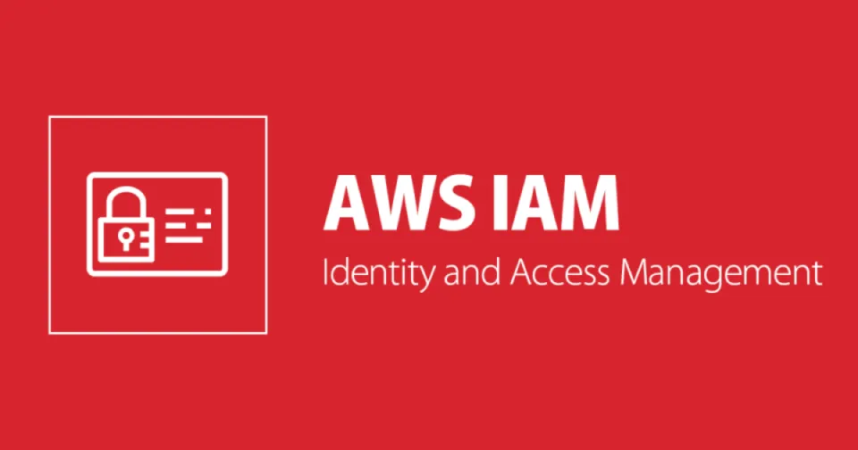

# Identity and Access Management

## Security
*Best practice to only provide permissions required to do a job or task. Eg: Least Priviledge Access*

## IAM
* Every AWS Account has its own IAM Database which is a globally resiliant service. **Note: Any data, is always secure across all AWS Regions**
* Dedicated instance from all other accounts and everyone elses accounts.
* Your AWS Account trusts your instance of IAM
* IAM can do anything in the account. Eg: Similar to the ROOT user
    * Exlusions:  Billing Control & Account Closure

* Lets you create 3 Identity Objects

    | Objects | Description |
    | ----------- | ----------- |
    | User | Represents `Humans` or `applications` that need access to account. |
    | Group | Collection of `related users` Eg: dev team, finance, HR. |
    | Role | Can be used by `AWS Services` or for granting external access to account. |

* Policies `allow` or `deny` access to AWS Services, only when attached to an Identity Object. They do nothing on their own.

## High Level (3 Main Jobs)
1. Identity Provider (IDP): - Create and Management Identities
2. Authentication: - Prove who you are or claim to be.
3. Authorize: - Allow or Deny access to resources based on policies.

## Pointers
1. IAM is provided at no cost.
2. Global Service, Global Resilience
3. Allow or Deny its identities on its AWS Account
4. No direct control on external accounts or users
5. Support Identity federation and MFA