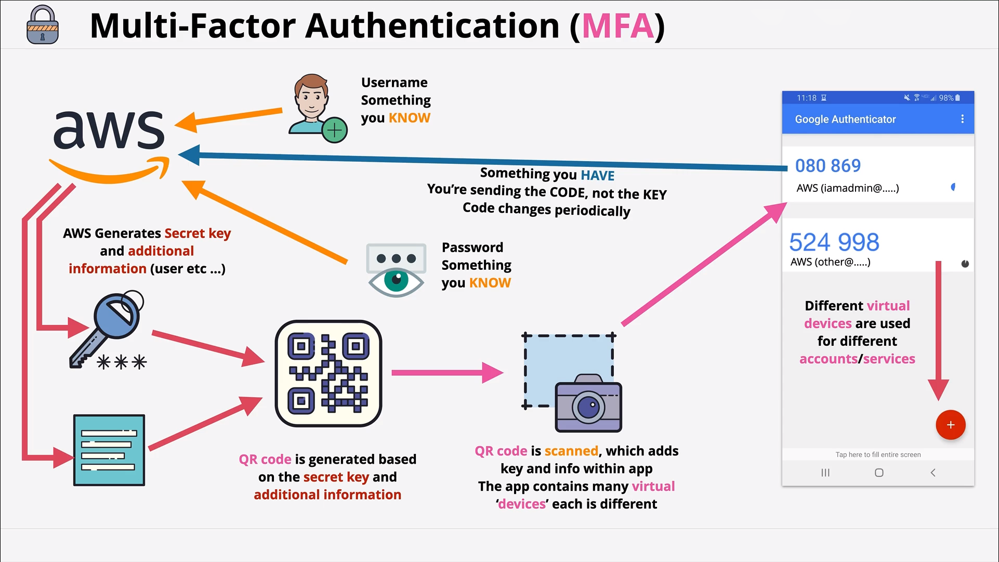

# Multifactor Authentication

## Why MFA is needed...
1. Typical login process involves username and password
    * if leaked, anyone can be you?
2. Factors
    * Difference pieces of evidence which proved indenity

    * Four Common Factors
        | Factors      | Description |
        | ----------- | ----------- |
        | Knowledge      | Something you know, like username and password.      |
        | Posession   | Something you have, bank card, mfa device/and or application.        |
        | Inherent | Something you are. Eg: fingerprint, voice or iris. |
        | Location | Physical location or network location (corp, wifi) |
    
    * `Single Factor Authentication`: Means to use one type of factor
    * `Multi-factor Authentication`: Use of more than one factor
    
***More factors means more security and harder to fake!***

## How MFA is implemented in AWS
AWS Supports both Hardware and Virtual based MFA

With MFA enabled, when a user signs in to an AWS Management Console, they will be prompted for their user name and password (the first factor—what they know), as well as for an authentication code from their AWS MFA device (the second factor—what they have). Taken together, these multiple factors provide increased security for your AWS account settings and resources.