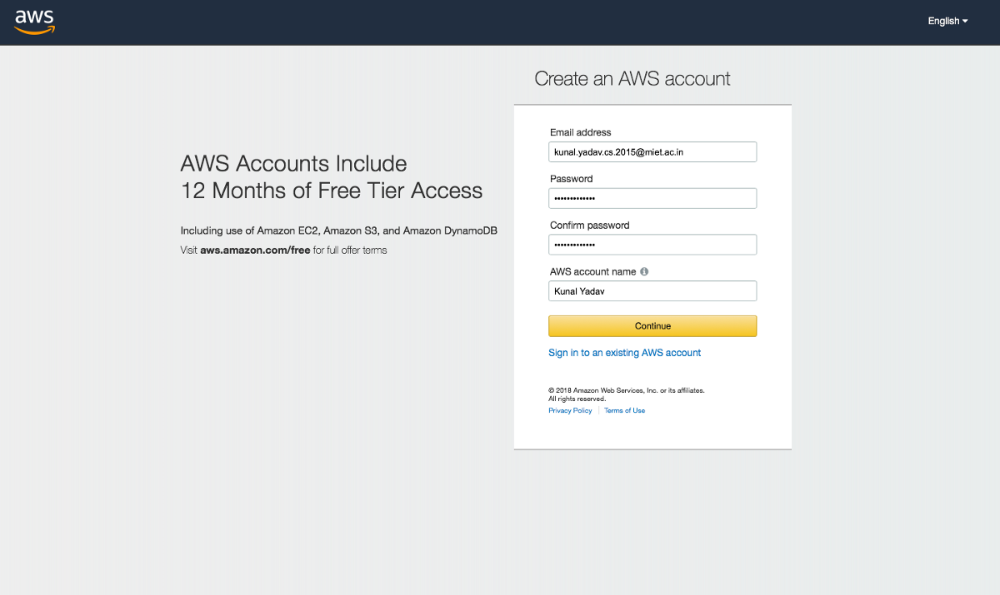

# The Basics


## AWS Accounts
High Level: AWS Account is a container for indenties and AWS Resources

## Creating Accounts
 1. Provide an account name. Eg: Production
 2. Provide a unique email address
 3. Provide payment information

- *Every AWS account has its own ROOT USER*
- *It's the only user created during Account Setup*
- *ROOT user has full control over that one specific AWS Account and any resources which are created inside it.*
- *ROOT user cannot be restricted and will always have full control within the AWS Account which it belongs to.*

## Payments
 1. AWS is a pay as you go platform.
 2. Certain services include a certain allocation of free usage per month, known as the free tier.
 3. Resources bill to the AWS Account payment method as they are consumed.

 ## Security
 **Identity and Access Management (IAM)**
  - [A] IAM Users
  - [B] IAM Groups
  - [C] IAM Roles
* *Start off with no access to the AWS Account*
* *Given full or limited permissions*
* *By default all acess to an AWS Account is denied*

## GMail Trick
Add a plus sign to your username followed by account name. This unique email address will be sent to your normal gmail account.
```sh
myuser+awsproduction@gmail.com
```
*Other emails providers provide a similar service. Eg: Yahoo allows up to a certain number of alias accounts*