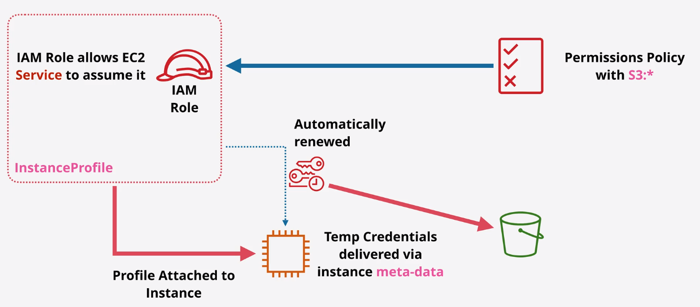

# EC2 Instance Roles & Profile

* Credentials are inside meta-data
* iam/security-credentials/`role-name`
* Automatically rotated - Always valid
* Should always be used rather than adding access keys into instance
* CLI tools will use ROLE credentials automatically

