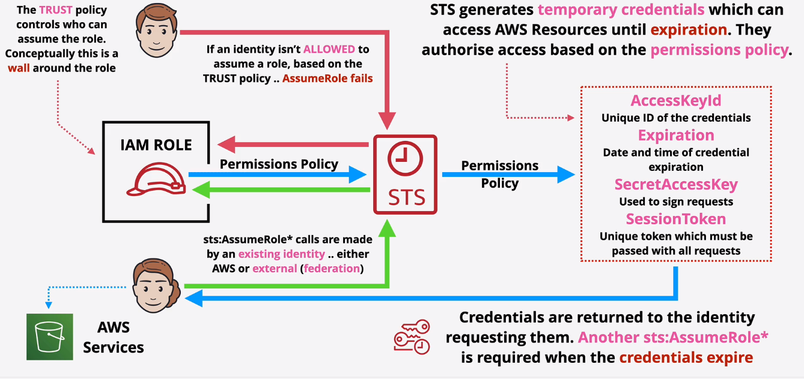

# Security Token Service (STS)

* Generates temporary credentials (sts:AssumeRole*)
* Similar to access keys
* They expire and don't belong to the identity
* Limited Access
* Used to access AWS Resources
* Requested by an Idenity (AWS or External)

