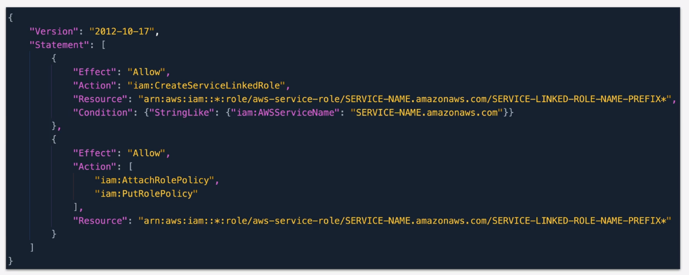

# Service Linked Roles

**IAM role linked to a `specific AWS service` predefined by a service, providing permission that a `service` needs to interact with `other AWS services` on your behalf.**

* `Service` might create/delete the role.
* Allow you to create during `setup` or with `IAM`
* Can't be deleted until it's no longer required

