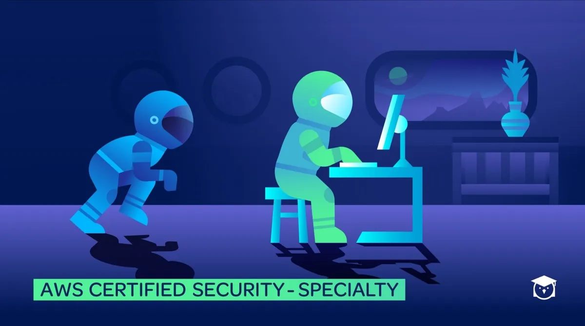

# AWS Certified Security Specialty

# My Objective
This is my personal `study guide` for the examination and keep track of my progress.

# What is AWS Certified Security Specialty
AWS Certified Security – Specialty is intended for individuals who perform a security role and have at least two years of hands-on experience securing AWS workloads. Before you take this exam, we recommend you have:

* Five years of IT security experience in designing and implementing security solutions and at least two years of hands-on experience in securing AWS workloads

* Working knowledge of AWS security services and features of services to provide a secure production environment and an understanding of security operations and risks

* Knowledge of the AWS shared responsibility model and its application; security controls for workloads on AWS; logging and monitoring strategies; cloud security threat models; patch management and security automation; ways to enhance AWS security services with third-party tools and services; and disaster recovery controls, including BCP and backups, encryption, access control, and data retention

* Understanding of specialized data classifications and AWS data protection mechanisms, data-encryption methods and AWS mechanisms to implement them, and secure internet protocols and AWS mechanisms to implement them

* Ability to make tradeoff decisions with regard to cost, security, and deployment complexity to meet a set of application requirements