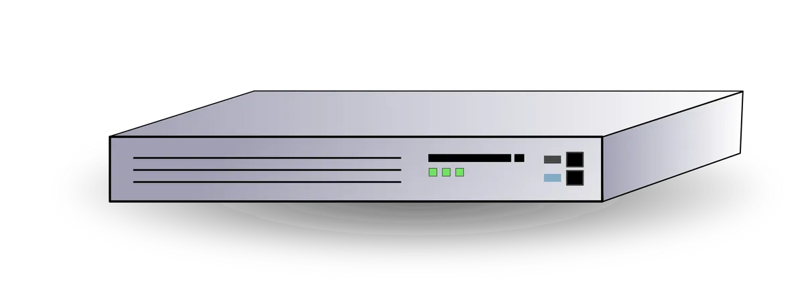

# Data Link (Layer 2)

## Frame
Requires a functional `layer 1` network to operate.
`Frames` are a format for sending information over a `layer 2` network. It also introduces a unique hard address, called a `MAC` address for every device on the network.

## MAC Adress
* 48 bits in hex. eg: (3e:22:fb:b9:5b:75)
* 24 bits for manufacturer
* Frames can be addessed to destination or broadcast (ALL F's)

## Frame Breakdown
Is a container. 1-4 make up what is known as the `MAC HEADER`. 
The `PAYLOAD` is the data the frame carries from the `source` to the `destination`. It's generally provided by `Layer 3` and the `EtherType (ET)`.

1. PREAMBLE | 56 Bits | SFD 8 Bits (Allow devices to know its the start of the frame)
2. Destination MAC Address
3. Source MAC Address
4. ET | 16 Bits (Specify which layer protocol is putting its data inside the frame.)
5. Payload (46 - 1500 BYTES)
6. FCS | 32 bits

## Game Example
1. Player #1 uses layer 2 (ethernet) which intended to send data to 3e:22:fb:b9:5b:76. Layer creates a Frame (F1)

3. Checks Carrier

3. If `NO` carrier, layer 1 takes the frame data and converts to physical standard and transmits.

4. Player #2 Layer 1 receives the data and passes the frame to layer 2.
5. Player #2 needs to send data to Player #1. Its layer 2 builds a `frame`.
6. `Carrier detect`: Wait another device in transmitting.
7. `Frame` sent to Layer 1 for `tranmission`.
8. If collisions are detected (both trasmitting at once) both backoff for a time + random. Increases if another close collision.

### Layer 2 - Data Link
Layers are independent - conceptually Player #1 L2 is talking to Player #2 L2

## Switches (Layer 2 Device)
Switches understand `frames` and `MAC Addresses`. They maintain a `MAC Address Table` which starts off empty. As the switch receives frames on its ports, it learns which devices are connected and populates the MAC Address Table.

If a `frame` is trasmitting to a MAC Address other than `all f's` it will be forwarded to that `one specific port` if the destination MAC address is in the table. If not, it will be forwarded to `all ports`. Any frames with `all f's` will always be fowarded to all ports.

Switch `STORE` and `FORWARD`. They dont repeat blindly like hubs. It means that only `valid` frames are forwarded. `Collisions` are isolated on the port they occured. Every `X` port switch `X` collision domains. It allows switches to scale and be connected together.

## Summary
* Identifiable devices
* Media Access Control (Sharing)
* Collision Detection
* Unicast 1:1
* Broadcast 1:ALL
* Switches