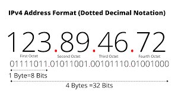

# Decimal to Binary Conversion (IP Addressing)

## Human vs Computer
 * Human reads IP Address as, eg: `133.33.33.7` known as dotted decimal notation.
 * Computer reads the IP Address as, eg: `10000101.00100001.00100001.00000111` 32 Bit binary number broken down as `4 x 8 Bits`, `4 x Bytes` and `4 x Octests`

## Converting Decimal to Binary
133.33.33.7 -> Each `decimal number` between dots, has a value between 0 and 255. Do each part 1 by 1.

133 Equals:
| Position | 1 | 2 | 3 | 4 | 5| 6 | 7 | 8  
|---|---|---|---|---|---|---|---|---|
| **Binary Position Value** | 128 | 64 | 32 | 16 | 8 | 4 | 2 | 1 |
| **Binary Value** | 1 | 0 | 0 | 0 | 0 | 1 | 0 | 1 |

33 Equals:
| Position | 1 | 2 | 3 | 4 | 5| 6 | 7 | 8  
|---|---|---|---|---|---|---|---|---|
| **Binary Position Value** | 128 | 64 | 32 | 16 | 8 | 4 | 2 | 1 |
| **Binary Value** | 0 | 0 | 1 | 0 | 0 | 0 | 0 | 1 |

7 Equals:
| Position | 1 | 2 | 3 | 4 | 5| 6 | 7 | 8  
|---|---|---|---|---|---|---|---|---|
| **Binary Position Value** | 128 | 64 | 32 | 16 | 8 | 4 | 2 | 1 |
| **Binary Value** | 0 | 0 | 0 | 0 | 0 | 1 | 1 | 1 |

1. Compare decimal number to Binary position. If smaller write 0 the move onto the next table position.
2. If its equal or larger, minus the binary position value from your decimal add 1 in the binary value column.
3. Move on to the next position, go to #1 (with new decimal value)

## Converting Binary to Decimal
10000101.00100001.00100001.00000111

Work from left to right -> do each `octet` one by one. Using the binary table above, for each binary value with a 1 add its coresponding binary position value.
* 128 + 4 + 1 = 133
* 32 + 1 = 33
* 4 + 2 + 1 = 7