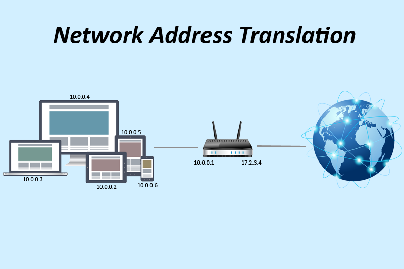
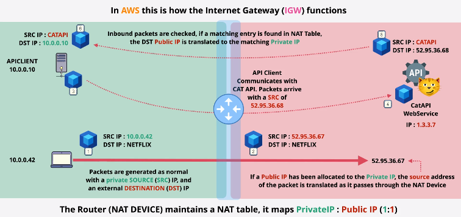
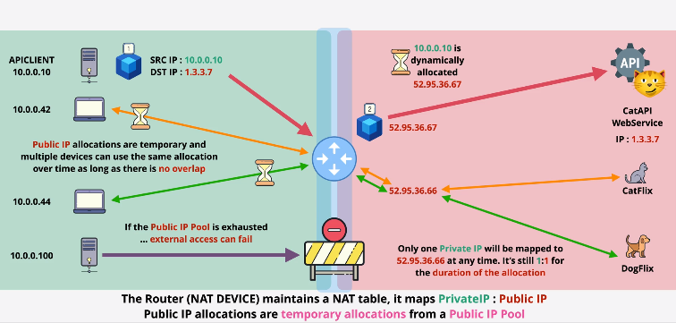
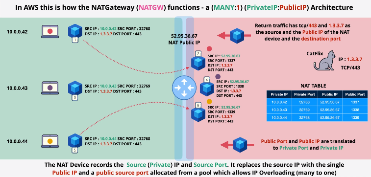

# Network Address Translation (NAT)

# High Level Functions
* `NAT` is designed to overcome the IPv4 shortages.
* `NAT` also provides some additional `security benefits`.
* Translates `Private` IPv4 addresses to `Public` IPv4 addresses.
* `Static NAT`: 1 private to 1 (fixed) public address (IGW).
* `Dynamic NAT`: 1 private to 1st available Public.
* Port Address Translation (`PAT`): many private to 1 public (NATGW).
* IPv4 only... no sense with IPv6.

# `Static` Network Address Translation

*In `AWS` this is how the Internet Gateway (IGW) Functions*

# `Dynamic` Network Address Translation

# Port Address Translation (`PAT`)

*In `AWS` this is how the NAT Gateway (NATGW) Functions*
