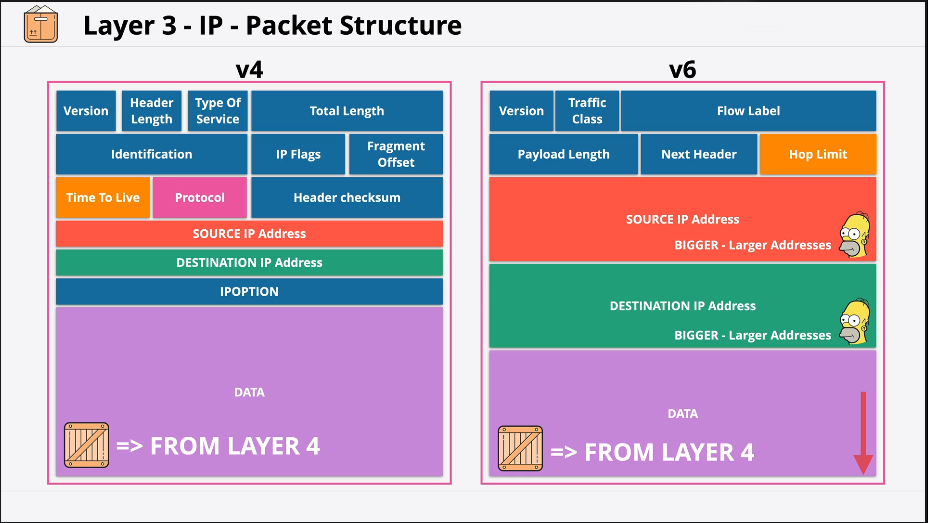
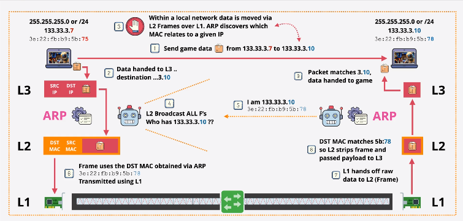
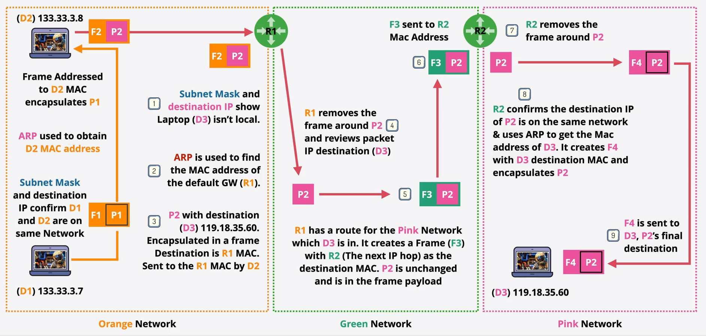

# Network


# LAN (Local Area Network)
LAN 1 and LAN 2 are isolated `local area networks`. Using only layer 2, only those networks joined by a `direct point to point link` using the SAME player 2 protocol could communicate.

Ethernet is a `L2` protocol generally used for `local networks`. Long distance point to point links will use other more suitable protocols such as `PPP/MPLS/ATM`

# L3 Network
L3 common protocol which can span multiple different L2 Networks. Can be added on one or more layer 2 networks.

Add the following capabilities:<br>
Internet Protocol (IP) Layer 3 protocol which adds cross-network `IP addressing` and `routing` to move data between `Local Area Networks` without direct P2P links.

IP Packets are moved step by step from `source` to `destination` via intermediate networks. Encapsulation in different frames along the way. `Routers (L3)` devices remove frame `encapsulation` and add `new frame encapsulation` at every `hop`.

# IP Packet Structure / Addressing


### v4/IPv4
IP Address: 133.33.3.7 (Dotted-decimal notation 4x0-255)<br>
All IP Addresses have a `Network` part. In this example represented by: `133.33` and a `Host` part represented by: `3.7`

```If the `Network` part of two IP addresses match, it means they are on the same IP network. If not they are on different networks.```

IP Addresses are actually binary. 4 sets of 8 bits (octets) for a total of 32 bits. Read left to right. eg: 10000101.00100001.00000011.00000111 Ref: [IP Addressing](ip.md) for Binary <=> Decimal Conversion

```This network has a /16 prefix. 16 bits of the IP are network, and the remaining buts are for hosts```

IP Address are assigned by `DHCP (Dynamic Host Configuration Protocol)` or Humans. IP Address need to be unique to avoid conflict.

### Subnet Mask
A `Subnet Mask` is configured on a host device in addition to an IP Address eg: `255.255.0.0` and this is the same as `/16` prefix.

A subnet mask is a dotted decimal version of a binary number which indicates which part of an IP address is NETWORK `represented as 1s` and which part is a HOST `represented as 0s` Eg: 255.255.0.0 is represented as 11111111.11111111.00000000.00000000

NET Start:
| 133. | 33. | 0. | 0 |
|---|---|---|---|
| 10000101 | 00100001 | 00000000 | 00000000 |

NET End:
| 133. | 33. | 255. | 255 |  
|---|---|---|---|
| 10000101 | 00100001 | 11111111 | 11111111 |

```It's the `Subnet Mask` which allows a HOST to determine if an IP address it needs to communicate with is a local or remote - which influences if it needs to use a gateway or can communicate locally.```

# Route Tables & Routes


# Address Resolution Protocol (ARP)


# L3 IP Routing


# Summary
* IP Address (IPv4/v6) - cross network addressing
* ARP - Find the MAC address, for this IP
* Route - where to foward this packet
* Route Table - Multiple Routes
* Router - moves packets from `SRC` to `DST` - Encapsulating in L2 on the way.
* Device <=> Device Communications over the internet.
* No method for channels of communcations..SRC IP <=> DST IP Only.
* Can be delivered out of order.