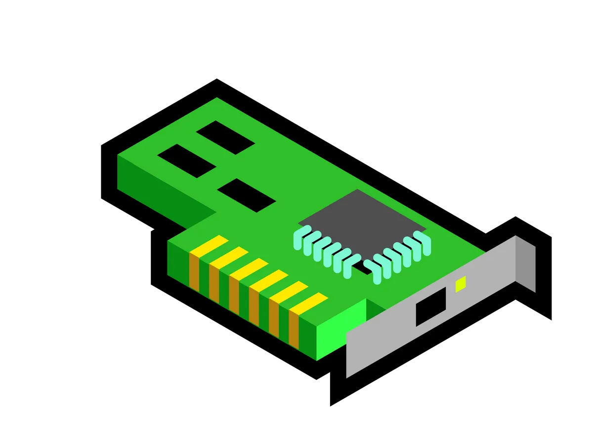

# Physical (Layer 1)

## Physical Medium
Can be `Copper` (electrical), `Fibre` (light) or `WiFi` (RF)

## Specifications
Define the transmission and reception of `RAW BIT STEAMS` between a device and `SHARED physical medium`. It definds things like `voltage levels, timing, rates, distances, modulation` and `connectors`.

## Layer 1 / Example device: Hubs
Anything received on any port is `transmitted on every other port`, including `errors` & `collisions`.

`No device addressing`, all data is processed by all devices.

If multiple devices transmit at once, then a `collision` would occur.

L1 Has no `media access control` and no `collision detection`.

Do not scale very well.

## Summary
* Physical shared medium
* Standards for transmitting onto the medium
* Standards for receiving from the medium
* No Access Controll
* No uniquely identified devices
* No device => device communications