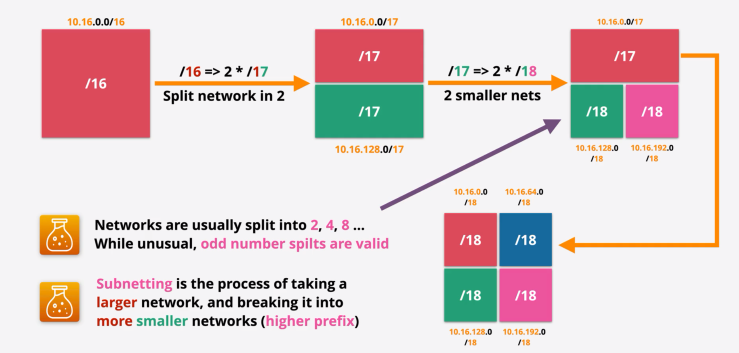
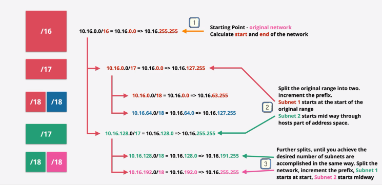

# IP Addressing and Subnetting
* IPv4 standard created in 1981, `RFC791`
* 0.0.0.0 -> 255.255.255.255 = `4,294,967,296` Addresses
* Originally directly managed by `IANA`
* Internet Assigned Numbers Authority
* Parts now delegated to `regional authorities`
* All public IPv4 addressing is `allocated`
* Part of the address space is `private` can be used/reused freely

## IPv4 Classes
* Class A: Huge Businesses, Early Internet
  - Start: 0.0.0.0
  - End: 127.255.255.255
  - 128 Networks / 16,777,216 IPs Each
* Class B: Large Businesses
  - Start: 128.0.0.0
  - End: 191.255.255.255
  - 16,384 Networks / 65,536 IPs Each
* Class C: Small Businesses
  - Start: 192.0.0.0
  - End: 223.255.255.255
  - 2,097,152 Network / 256 IPs Each
* Class D: Used for Multicast
* Class E: Reservered

## IPv4 Addressing & Subnetting (Private)
* Defined by standard `RFC1918`
* 10.0.0.0 - 10.255.255.255 (1 x `Class A` Network) / 16,777,216 IPv4 Addresses
* 172.16.0.0 - 172.31.255.255 ( 16 x `Class B` Networks) / 16 x 65,536 IPv4 Addresses
* 192.168.0.0 - 192.168.255.255 ( 256 x `Class C` Networks) / 256 x 256 IPv4 Addresses

## IPv4 Address Space
* IPv4 4,294,967,296
* IPv6 340,282,366,920,938,463,374,607,431,770,000,000

