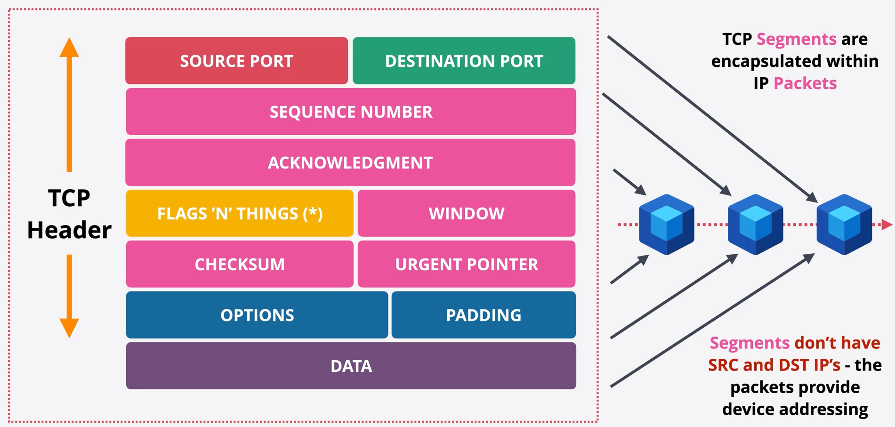

# Transport and Sessions

# Transport Layer (Layer 4)
## Layer 3 Problems
* Each packet is routed `independently`.
* Routing decisions are `per packet`. Different routes can result in `out of order packets` at the destination. L3 provides no ordering mechanism.
* Communcation is `not guaranteed` to be reliable. Packets can be `lost` en route.
* Per packet routing can introduce `delays` to packets en route. `Different packets` can experience `different delays`.
* There are `no communcation channels`. Packets have a Source and Destination IP but `no method` of splitting `APP` or `CHANNEL`.
* `No flow control`. If the source transmits faster than the destination can receive, it can saturate the destination causing packet loss.

## TCP and UDP
* TCP - Slower but reliable
* UDP - Fast but less reliable. *"I'd tell you a UDP joke...but you might not get it!"*
* Runs on top of IP

## TCP Segments
* TCP `Segments` are enscapsulated within IP `Packets`
* `Segments` dont have `SRC` and `DST` IPs. The packets provide device addressing.

## Transmission Control Protocol (TCP)
* TCP is `connection` based protocol. A connection is established between two devices using a `random port` on client and a `known port` on the server. Once established, the connection is `bi-directional`. The connection is a reliable connection, provided via the `segments` encapsulation in IP Packets.
* L3 Packets provide no error checking, no ordering and no association.
* Segments linked to a connection, provide checking, ordering and restransmission.

## TCP Connection 3-way Handshake
* Flags which can be set to alter the connection. E.g `FIN` can be used to close, `ACK` for acknowledgements, `SYN` to synchronise sequence numbers.
1. Client -> SYN (Initial Sequence Number: eg CS) -> Server
2. Server -> SYN (ISN: eg SS) & ACK (CS+1) -> Client
3. Client -> ACK (CS+1 & SS+1) -> Server
4. <- Connection Established ->

## Session & State
* Network ACL (AWS)

A `Stateless` firewall would see two things. 
`Outbound` -> Laptop/tcp/23060 => Server/tcp/443 
`Response` -> Server/tcp/443 => Laptop/tcp/23060 
TWO RULES will be required... `OUT` and `IN`.

* Security Group (AWS)

A `Stateful` firewall views and sees one thing 
`Outbound` -> Laptop/tcp/23060 => Server/tcp/443 
Allowing the outbound implicity allows the `inbound response`.