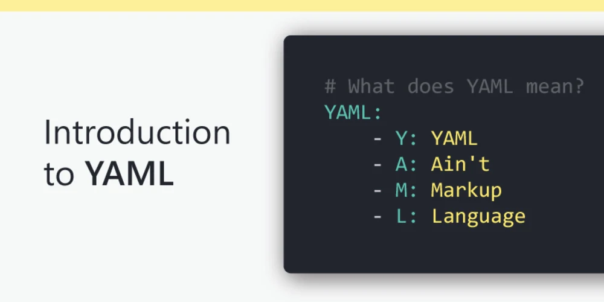

# YAML 101


## What is YAML
YAML is a data serialization language that is often used for writing configuration files. Depending on whom you ask, YAML stands for yet another markup language or YAML ain’t markup language (a recursive acronym), which emphasizes that YAML is for data, not documents.

*`Human` readable `data serialization` language.*

## High Level
A YAML document is an unordered collection of `key:value` pairs. It supports strings, numbers, floating point, boolean and null.

## Introduction
YAML can represent `sequences` or `list`. This are comma-sperated and enclosed in bracks `[ ]`. This is known as `inline`. Example:
```js
osimodel: ["physical layer", "data link layer", "network layer", "transport layer", "session layer", "presentation layer", "application layer"]
```
This also can represented as:
```js
osimodel:
  - "physical layer"
  - "data link layer"
  - "network layer"
  - "transport layer"
  - "session layer"
  - "presentation layer"
  - "application layer"
```
Value can be enclosed in `" "`, `' '` or not. All are valud but enclosing can be more precise and avoids confusion.

Identation in YAML matters and always done using spaces. The same level of indentation means that the things are within the same structure.

## Dictionary
*Dictionary is a data structure:* A collection of `key:value` pairs which are unordered. Example:

```js
osimodel:
  -name: "physical layer"
   layer: 1
  -name: "data link layer"
   layer: 2
  -name "network layer"
   layer: 3
  -name "transport layer"
   layer: 4
  -name "session layer"
   layer: 5
  -name "presentation layer"
   layer: 6
  -name "application layer"
   layer: 7
```
YAML files can be read into an application or written by an application. They are commonly used for configuration files. 

Eg: CloudFormation Templates

```js
Resources:
  s3bucket:
    Type: "AWS::S3::Bucket"
    Properties:
      BucketName: "osimodel"
```