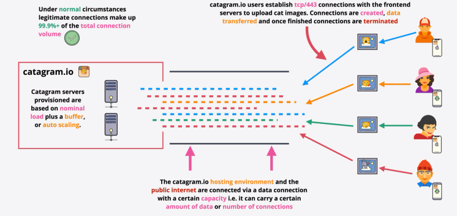
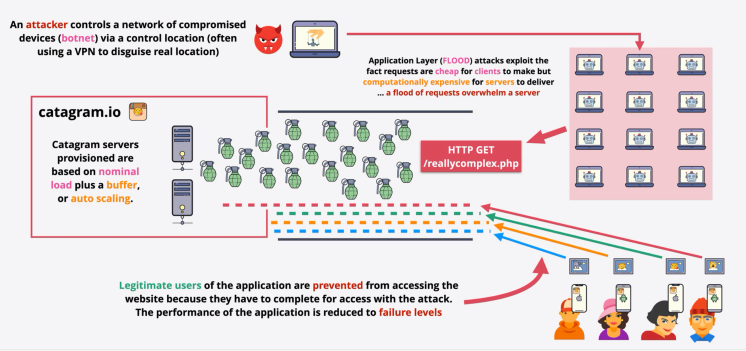
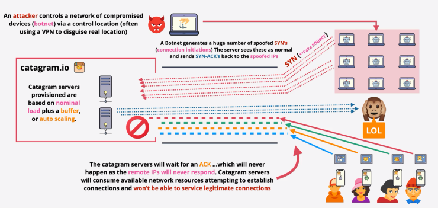
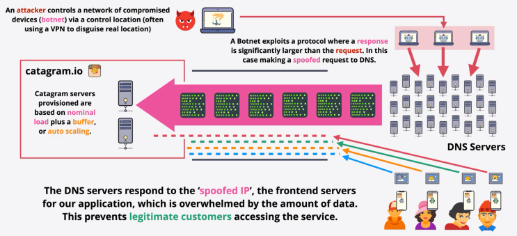

# Distributed Denial of Service DDoS
* Attacks designed to `overload` websites.
* `Compete` against `legitimate connections`
* `Distributed` hard to block to individial IPs/Ranges.
* `Application` Layer - HTTP Flood
* `Protocol` Attack - SYN Flood
* `Volumetric` DNS Amplification
* Often involve large armies of compromised machines (`botnets`)

## Normal

## Application Layer Attack

## SYN Flood

## Volumetric
